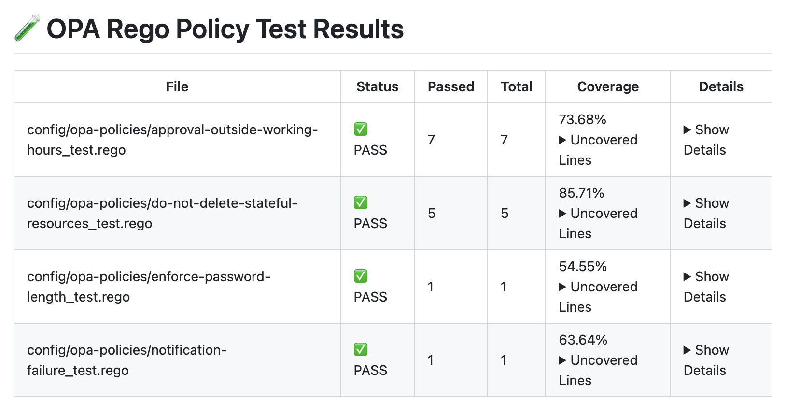

[](https://masterpoint.io)

# GitHub Action for OPA Rego Policy Tests <!--[](https://github.com/masterpointio/github-action-opa-rego-test/releases/latest)-->

GitHub Action to automate testing for your OPA (Open Policy Agent) Rego policies, generates a report with coverage information, and posts the test results as a comment on your pull requests, making it easy for your team to review and approve policies.

Use this to test your OPA Rego files for [Spacelift policies](https://docs.spacelift.io/concepts/policy), Kubernetes Admission Controller policies, Docker authorization policies, or any other use case that uses [Open Policy Agent's policy language Rego](https://www.openpolicyagent.org/docs/latest/). This Action also updates PR comments with the test results in place to prevent duplication.




See examples of the pull request comments below at the [Example Pull Request Comments section](#-example-pull-request-comments).

📚 Table of Contents

- [🚀 Usage](#-usage)
  - [Inputs](#inputs)
- [⚙️ How It Works](#️-how-it-works)
- [🧪 Running Tests](#-running-tests)
- [🏗️ Setup & Run Locally](#️-setup--run-locally)
- [📦 Releases / Packaging for Distribution](#-releases--packaging-for-distribution)
- [🤝 Contributing](#-contributing)
- [💬 Example Pull Request Comments](#-example-pull-request-comments)

## 🚀 Usage

It's super easy to get started and use this GitHub Action to test your OPA Rego policies. In your repository/directory with the `.rego` files and the `_test.rego` files, simply checkout the repository and add the step with `uses: masterpointio/github-action-opa-rego-test@main`. It's as simple as adding the step with no required inputs! It will then generate a PR comment (that updates in place) with the test results!

```yaml
- name: Run OPA Rego Tests
  uses: masterpointio/github-action-opa-rego-test@main
```

<details>
    <summary>Expand to see full usage example!</summary>

```yaml
name: Spacelift Policy OPA Rego Tests

on:
  pull_request:
    # Optionally only trigger tests on affecting .rego files.
    # paths:
    #   - '**.rego'

permissions:
  id-token: write
  contents: read
  pull-requests: write # required to comment on PRs

jobs:
  opa-tests:
    runs-on: ubuntu-latest
    steps:
      - name: Check out repository code
        uses: actions/checkout@v4

      - name: Run OPA Rego Tests
        uses: masterpointio/github-action-opa-rego-test@main
        with:
          path: "./config/spacelift-policies" # Path of the directory where the OPA Rego policies are stored. Optional, defaults to `.` which is the root directory.
          report_untested_files: true # Flag to check & report Rego files without corresponding test files. Optional, defaults to false.
```

</details>

Be sure to always append the postfix to your test files. The default input for the `test_file_postfix` is `_test`, per [OPA's best practices](https://www.openpolicyagent.org/docs/latest/policy-testing/#test-format). If you have a different postfix for your test files, you can specify it in the inputs. This is how GitHub Action know what test to run on files.

For example, if you have a file named `my-policy.rego`, you would need a file named `my-policy_test.rego`. It does not matter where the `_test.rego` file is located, just that it is in the root path, meaning that it can be in a subdirectory.

In the example below, all `_test.rego` files' location are valid and will be executed.


### Inputs

| Input                   | Description                                                                                | Required | Default                           |
| ----------------------- | ------------------------------------------------------------------------------------------ | -------- | --------------------------------- |
| `path`                  | Path to the directory containing OPA Rego files to test                                    | No       | `.` (root directory)              |
| `test_file_postfix`     | Postfix of the test files to run (e.g. notification.rego <> notification_test.rego)        | No       | `_test`                           |
| `write_pr_comment`      | Flag to write a user-friendly PR comment with test results                                 | No       | `true`                            |
| `pr_comment_title`      | Title of the PR comment for test results                                                   | No       | `🧪 OPA Rego Policy Test Results` |
| `pr_comment_mode`       | Mode that will be used to update comment. Options of upsert (update in place) or recreate. | No       | `upsert`                          |
| `run_coverage_report`   | Flag to run OPA coverage tests and include in PR comment                                   | No       | `true`                            |
| `report_untested_files` | Check & report Rego files without corresponding test files                                 | No       | `false`                           |
| `opa_version`           | Version of the OPA CLI to use.                                                             | No       | `0.67.1`                          |

### Outputs

| Output           | Description                                                            |
| ---------------- | ---------------------------------------------------------------------- |
| `parsed_results` | The parsed results after processing the tests and/or coverage report.  |
| `tests_failed`   | A `true` or `false` flag indicating if any of the tests failed or not. |

## ⚙️ How It Works

This GitHub Action automates the process of testing OPA (Open Policy Agent) Rego policies and generating coverage reports. Here's a breakdown of its operation:

1. Setup: The action begins by setting up OPA using the open-policy-agent/setup-opa@v2 action, ensuring the necessary tools are available.
2. Run OPA Tests: It executes `opa test` on all .rego files in the specified directory (default is the root directory). The test results are captured and stored as an output.
3. Run OPA Coverage Tests: Enabled by default but optional, the action performs coverage tests on each .rego file that has a corresponding \_test.rego file. This step identifies which parts of your policies are covered by tests.
4. Find Untested Files: Optionally if enabled, it can identify Rego files that don't have corresponding test files, helping you maintain comprehensive test coverage.
5. Parse and Format Results: A custom TypeScript script (index.ts) processes the raw test and coverage outputs. It parses the results into a structured format and generates a user-friendly summary.
6. Generate PR Comment: The formatted results are used to create or update a comment on the pull request.
7. Fail the Action if Tests Fail: If any tests fail, the action is marked as failed, which can be used to block PR merges or trigger other workflows.


## 🧪 Running Tests

1. `npm install`
2. `npm run test`


## 🏗️ Setup & Run Locally

You can use [nektos/act](https://github.com/nektos/act) to simulate and run a GitHub Actions workflow locally. To directly test the custom TypeScript action locally, you can:

1. `npm run install`
2. `node ./dist/index.js`
   This is assuming you have `npm` and `node` installed already. Note: You will have to manually provide the required inputs since this is directly executing the TypeScript code.

## 📦 Releases / Packaging for Distribution

This Action executes the source from the `/dist` directory. It is generated using [@vercel/ncc](https://github.com/vercel/ncc) to easily compile the TypeScript module into a single file together with all its dependencies, gcc-style, to package it up for use and distribute.

To package for distribution, simply run the command which will do the above and generate into the `/dist` directory (see the source in `package.json`):

```bash
npm run build
```

To create a new release... TODO, release please with `npm run build` and commit to /dist distribution

## 🤝 Contributing

Contributions are welcome! Please feel free to submit a Pull Request or open any issues you may have.

## 💬 Example Pull Request Comments

- 
  - Using `report_untested_files` to indicate policies without corresponding tests.
- 
- 

### To-Do's:

- make composite action logging better
- add debug logs
- more tests + fix tests + run test on ci
- deal with issues like
  - `1 error occurred: ./access/label-based-team-access.rego:35: rego_type_error: conflicting rules data.spacelift.deny found`
  - need better visibliity to when this happens and fails
  - right now, it just exits code 2. not helpful and someone new to sys wouldn't know where to look at.
  - one way is to PR comment error occured in the execution of the tests. please tak eal ook at the logs..
- publish to marketplace
- codeowners
